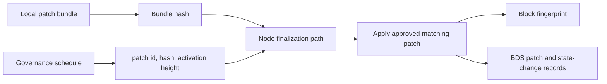

# State Patches

This directory contains documentation and example assets for the governed
state-patch system.

## Purpose

State patches let the chain apply pre-reviewed state changes at a specific block
height without requiring a fork or full reset. Typical uses include:

- correcting broken state after a bug
- applying governance-approved remediation
- deploying or updating contract source through a governed path
- shipping emergency fixes with explicit validator coordination

## Runtime Model

The current implementation is bundle-based and governance-driven:

- nodes load local patch bundle files from
  `<COMETBFT_HOME>/config/state-patches/*.json`
- governance schedules a patch by `patch_id`, `bundle_hash`, and
  `activation_height`
- at block finalization, the node applies only approved scheduled patches whose
  local bundle matches the governed metadata
- applied patch executions are hashed and included in the block fingerprint path
- BDS persists the executed patch metadata and resulting state changes



The repo path here is not the runtime load location. The files in this folder
are examples and development fixtures only.

## Bundle Format

Each bundle file is a single JSON object:

```json
{
  "version": 1,
  "patch_id": "patch-example",
  "activation_height": 12345,
  "chain_id": "xian-local",
  "summary": "Repair incorrect contract state",
  "uri": "ipfs://example",
  "changes": [
    {
      "key": "con_example.value",
      "value": "patched",
      "comment": "Fix incorrect state value"
    }
  ]
}
```

Supported top-level fields:

- `version`: currently `1`
- `patch_id`: stable identifier used by governance and local inventory matching
- `activation_height`: block height where the patch may execute
- `governance_contract`: optional override; defaults to `governance`
- `chain_id`: optional guard to restrict a bundle to one chain
- `summary`: optional human-readable summary
- `uri`: optional external reference such as an IPFS URI or proposal link
- `changes`: non-empty list of state writes

Each change includes:

- `key`: full state key to write
- `value`: JSON-serializable value to persist
- `comment`: audit-oriented reason for the change

## Contract Source Patches

Bundle changes may target `contract.__source__`, but they may not patch
derived VM artifacts directly.

When a patch updates `contract.__source__`, the node derives and persists the
additional artifacts automatically:

- normalized `__source__`
- `__xian_ir_v1__` for the native VM path

## Database Integration

Applied state patches are persisted through BDS:

- the `state_patches` table stores execution metadata and canonical patch payloads
- executed patches are exposed as pseudo-transactions with hashes such as
  `STATE_PATCH_<height>`
- the resulting writes are also persisted in normal state-change history

## Query Surfaces

Local inventory and governance scheduling can be inspected through ABCI queries:

- `/state_patch_bundles`
- `/scheduled_state_patches/<height>`

BDS-backed historical execution queries are available through:

- `/state_patches`
- `/state_patches_for_block/<height>`
- `/state_patch/<hash>`
- `/state_changes_for_patch/<hash>`

## Files In This Folder

- `state_patches_example.json`: minimal example of a valid bundle file
- `README.md`: this overview

## Operational Notes

- validators must distribute the same local bundle bytes for a governed patch to
  execute successfully
- bundle hashes, activation heights, governance contract names, and optional
  `chain_id` values must match governance state
- invalid or missing local bundles fail loudly instead of silently disabling the
  patch path
